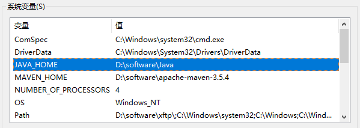

# 第一节 Maven核心程序解压与配置

## 1、解压Maven核心程序

核心程序压缩包：apache-maven-3.5.4-bin.zip，解压到非中文、没有空格的目录。例如：


在解压目录中，我们需要着重关注Maven的核心配置文件：conf/settings.xml

## 2、指定本地仓库

本地仓库默认值：用户家目录/.m2/repository。由于本地仓库的默认位置是在用户的家目录下，而家目录往往是在C盘，也就是系统盘。将来Maven仓库中jar包越来越多，仓库体积越来越大，可能会拖慢C盘运行速度，影响系统性能。所以建议将Maven的本地仓库放在其他盘符下。配置方式如下：

```xml
<!-- localRepository
| The path to the local repository maven will use to store artifacts.
|
| Default: ${user.home}/.m2/repository
<localRepository>/path/to/local/repo</localRepository>
-->
<localRepository>D:\maven-rep1026</localRepository>
```

本地仓库这个目录，我们手动创建一个空的目录即可。

从注释中拿出来。

非中文、没有空格的目录。

## 3、配置阿里云提供的镜像仓库

Maven下载jar包默认访问境外的中央仓库，速度很慢。改成阿里云提供的镜像仓库，访问国内网站，可以让Maven下载jar包的时候速度更快。配置的方式是：将下面mirror标签整体复制到mirrors标签的内部。

```xml
<mirrors>
	<mirror>
		<id>nexus-aliyun</id>
		<mirrorOf>central</mirrorOf>
		<name>Nexus aliyun</name>
		<url>http://maven.aliyun.com/nexus/content/groups/public</url>
	</mirror>
</mirrors>
```

## 4、配置Maven工程的基础JDK版本

如果按照默认配置运行，Java工程使用的JDK版本是1.5。配置的方式是：将profile标签整个复制到profiles标签内。

```xml
<profiles>
	<profile>
	  <id>jdk-1.8</id>
	  <activation>
		<activeByDefault>true</activeByDefault>
		<jdk>1.8</jdk>
	  </activation>
	  <properties>
		<maven.compiler.source>1.8</maven.compiler.source>
		<maven.compiler.target>1.8</maven.compiler.target>
		<maven.compiler.compilerVersion>1.8</maven.compiler.compilerVersion>
	  </properties>
	</profile>
</profiles>
```


# 第二节 配置环境变量

## 1、检查JAVA_HOME配置是否正确

Maven是一个用Java语言开发的程序，它必须基于JDK来运行，需要通过JAVA_HOME来找到JDK的安装位置。



可以使用下面的命令验证：

```bash
C:\Users\Administrator>echo %JAVA_HOME%
D:\software\Java

C:\Users\Administrator>java -version
java version "1.8.0_141"
Java(TM) SE Runtime Environment (build 1.8.0_141-b15)
Java HotSpot(TM) 64-Bit Server VM (build 25.141-b15, mixed mode)
```

## 2、配置MAVEN_HOME


> 配置环境变量的规律：
>
> XXX_HOME指向的是bin目录的上一级
>
> PATH指向的是bin目录

## 3、配置PATH


## 4、验证

```bash
C:\Users\Administrator>mvn -v
Apache Maven 3.5.4 (1edded0938998edf8bf061f1ceb3cfdeccf443fe; 2018-06-18T02:33:14+08:00)
Maven home: D:\software\apache-maven-3.5.4\bin\..
Java version: 1.8.0_141, vendor: Oracle Corporation, runtime: D:\software\Java\jre
Default locale: zh_CN, platform encoding: GBK
OS name: "windows 10", version: "10.0", arch: "amd64", family: "windows"
```


