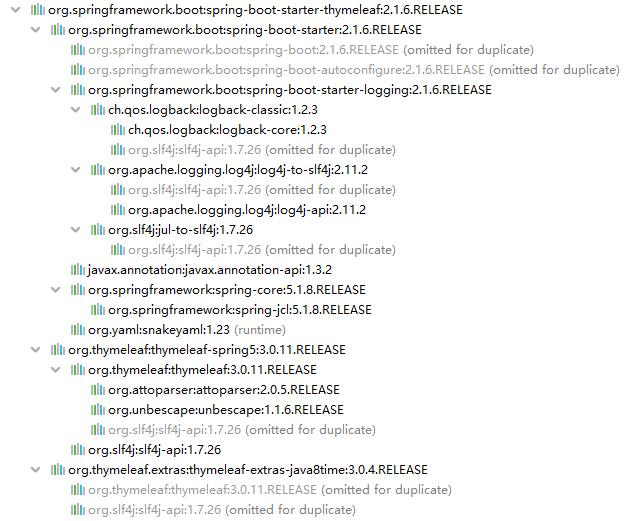

# 第一节 为什么要学习Maven？

## 1、从『构建』角度解释

### ①个人开发流程

### ②团队开发流程

> 引申：更大范围内的团队协作
>
>

## 2、从『依赖』角度解释

### ①jar包的规模

随着我们使用越来越多的框架，或者框架封装程度越来越高，项目中使用的jar包也越来越多。项目中，一个模块里面用到上百个jar包是非常正常的。

### ②jar包的来源

* 这个jar包所属技术的官网。官网通常是英文界面，网站的结构又不尽相同，甚至找到下载链接还发现需要通过特殊的工具下载。

* 第三方网站提供下载。问题是不规范，在使用过程中会出现各种问题。

  + jar包的名称
  + jar包的版本
  + jar包内的具体细节

### ③jar包之间的依赖关系

框架中使用的jar包，不仅数量庞大，而且彼此之间存在错综复杂的依赖关系。依赖关系的复杂程度，已经上升到了完全不能靠人力手动解决的程度。另外，jar包之间有可能产生冲突。进一步增加了我们在jar包使用过程中的难度。

到目前为止，我们熟悉的jar包之间依赖关系有下面这些例子：

* junit-4.12依赖hamcrest-core-1.3
* thymeleaf-3.0.12. RELEASE依赖ognl-3.1.26
  + ognl-3.1.26依赖javassist-3.20.0-GA
* thymeleaf-3.0.12. RELEASE依赖attoparser-2.0.5. RELEASE
* thymeleaf-3.0.12. RELEASE依赖unbescape-1.1.6. RELEASE
* thymeleaf-3.0.12. RELEASE依赖slf4j-api-1.7.26

而实际上jar包之间的依赖关系是普遍存在的，如果要由程序员手动梳理无疑会增加极高的学习成本，而这些工作又对实现业务功能毫无帮助。

# 第二节 什么是Maven？

Maven是Apache软件基金会组织维护的一款专门为Java项目提供依赖管理支持的工具。

## 1、构建

Java项目开发过程中，构建指的是使用『原材料生产产品』的过程。

* 原材料

  + Java源代码

  + 基于HTML的Thymeleaf文件

  + 图片

  + 配置文件

  + ###### ……

* 产品

  + 一个可以在服务器上运行的项目

构建过程包含的主要的环节：

* 清理：删除上一次构建的结果，为下一次构建做好准备
* 编译：Java源程序编译成*.class字节码文件
* 测试：运行提前准备好的测试程序
* 报告：针对刚才测试的结果生成一个全面的信息
* 打包
  + Java工程：jar包
  + Web工程：war包
* 安装：把一个Maven工程安装到Maven仓库
* 部署：将准备好的jar包或war包部署到服务器上运行

## 2、依赖

如果A工程里面用到了B工程的类、接口、配置文件等等这样的资源，那么我们就可以说A依赖B。例如：

* junit-4.12依赖hamcrest-core-1.3
* thymeleaf-3.0.12. RELEASE依赖ognl-3.1.26
  + ognl-3.1.26依赖javassist-3.20.0-GA
* thymeleaf-3.0.12. RELEASE依赖attoparser-2.0.5. RELEASE
* thymeleaf-3.0.12. RELEASE依赖unbescape-1.1.6. RELEASE
* thymeleaf-3.0.12. RELEASE依赖slf4j-api-1.7.26

依赖管理中要解决的具体问题：

* jar包的下载：使用Maven之后，jar包会从规范的远程仓库下载到本地
* jar包之间的依赖：通过依赖的传递性自动完成
* jar包之间的冲突：通过对依赖的配置进行调整，让某些jar包不会被导入

## 3、Maven的工作机制

