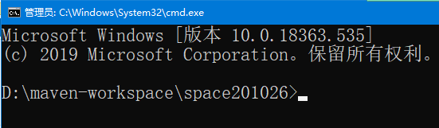
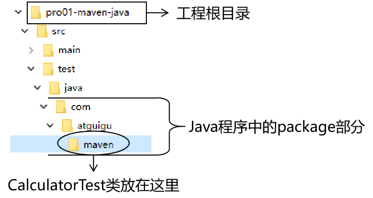
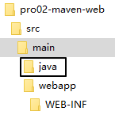
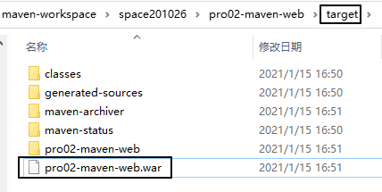
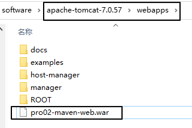
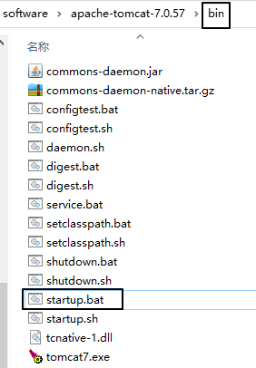

# 第一节 实验一：根据坐标创建Maven工程

## 1、Maven核心概念：坐标

### ①数学中的坐标


使用x、y、z三个“向量”作为空间的坐标系，可以在空间中唯一的定位到一个点。

### ②Maven中的坐标

#### [1]向量说明

使用三个向量在Maven的仓库中唯一的定位到一个jar包。

* groupId：公司或组织的id
* artifactId：一个项目或者是项目中的一个模块的id
* version：版本号

#### [2]三个向量的取值方式

* groupId：公司或组织域名的倒序，通常也会加上项目名称
  + 例如：com.atguigu.maven
* artifactId：模块的名称，将来作为Maven工程的工程名
* version：模块的版本号，根据自己的需要设定
  + 例如：SNAPSHOT表示快照版本，正在迭代过程中，不稳定的版本
  + 例如：RELEASE表示正式版本

举例：

* groupId：com.atguigu.maven
* artifactId：pro01-atguigu-maven
* version：1.0-SNAPSHOT

### ③坐标和仓库中jar包的存储路径之间的对应关系

坐标：

```xml
  <groupId>javax.servlet</groupId>
  <artifactId>servlet-api</artifactId>
  <version>2.5</version>
```

上面坐标对应的jar包在Maven本地仓库中的位置：

```text
Maven本地仓库根目录\javax\servlet\servlet-api\2.5\servlet-api-2.5.jar
```

一定要学会根据坐标到本地仓库中找到对应的jar包。

## 2、实验操作

### ①创建目录作为后面操作的工作空间

例如：D:\maven-workspace\space210323

### ②在工作空间目录下打开命令行窗口



### ③使用命令生成Maven工程

运行mvn archetype:generate命令

下面根据提示操作

> Choose a number or apply filter (format: [groupId:]artifactId, case sensitive contains): 7:【直接回车，使用默认值】
>
>
>
> Define value for property 'groupId': com.atguigu.maven
>
> Define value for property 'artifactId': pro01-maven-java
>
> Define value for property 'version' 1.0-SNAPSHOT: :【直接回车，使用默认值】
>
> Define value for property 'package' com.atguigu.maven: :【直接回车，使用默认值】
>
>
>
> Confirm properties configuration:
> groupId: com.atguigu.maven
> artifactId: pro01-maven-java
> version: 1.0-SNAPSHOT
> package: com.atguigu.maven
> Y: :【直接回车，表示确认】

### ④调整

Maven默认生成的工程，对junit依赖的是较低的3.8.1版本，我们可以改成4.12版本。

自动生成的App.java和AppTest.java可以删除。

```xml
<!-- 依赖信息配置 -->
<!-- dependencies复数标签：里面包含dependency单数标签 -->
<dependencies>
    <!-- dependency单数标签：配置一个具体的依赖 -->
    <dependency>
        <!-- 通过坐标来依赖其他jar包 -->
        <groupId>junit</groupId>
        <artifactId>junit</artifactId>
        <version>4.12</version>

        <!-- 依赖的范围 -->
        <scope>test</scope>
    </dependency>
</dependencies>
```

## 3、Maven核心概念：POM

### ①含义

POM：Model，项目对象模型。和POM类似的是：DOM：Document Object Model，文档对象模型。

### ②思想

POM表示将工程抽象为一个模型，再用程序中的对象来描述这个模型。这样我们就可以用程序来管理项目了。我们在开发过程中，最基本的做法就是将现实生活中的事物抽象为模型，然后封装模型相关的数据作为一个对象，这样就可以在程序中计算与现实事物相关的数据。

### ③对应的配置文件

POM理念集中体现在Maven工程根目录下pom.xml这个配置文件中。所以这个pom.xml配置文件就是Maven工程的核心配置文件。其实学习Maven就是学这个文件怎么配置，各个配置有什么用。

## 4、Maven核心概念：约定的目录结构

### ①各个目录的作用


另外还有一个target目录专门存放构建操作输出的结果。

### ②约定目录结构的意义

Maven为了让构建过程能够尽可能自动化完成，所以必须约定目录结构的作用。例如：Maven执行编译操作，必须先去Java源程序目录读取Java源代码，然后执行编译，最后把编译结果存放在target目录。

### ③约定大于配置

Maven对于目录结构这个问题，没有采用配置的方式，而是基于约定。这样会让我们在开发过程中非常方便。如果每次创建Maven工程后，还需要针对各个目录的位置进行详细的配置，那肯定非常麻烦。

目前开发领域的技术发展趋势就是：约定大于配置，配置大于编码。


# 第二节 实验二：在Maven工程中编写代码

## 1、主体程序

### ①自动生成的pom.xml解读

```xml
  <!-- 当前Maven工程的坐标 -->
  <groupId>com.atguigu.maven</groupId>
  <artifactId>pro01-maven-java</artifactId>
  <version>1.0-SNAPSHOT</version>

  <!-- 当前Maven工程的打包方式，可选值有下面三种： -->
  <!-- jar：表示这个工程是一个Java工程  -->
  <!-- war：表示这个工程是一个Web工程 -->
  <!-- pom：表示这个工程是“管理其他工程”的工程 -->
  <packaging>jar</packaging>

  <name>pro01-maven-java</name>
  <url>http://maven.apache.org</url>

  <properties>
    <!-- 工程构建过程中读取源码时使用的字符集 -->
    <project.build.sourceEncoding>UTF-8</project.build.sourceEncoding>
  </properties>

  <!-- 当前工程所依赖的jar包 -->
  <dependencies>
    <!-- 使用dependency配置一个具体的依赖 -->
    <dependency>

      <!-- 在dependency标签内使用具体的坐标依赖我们需要的一个jar包 -->
      <groupId>junit</groupId>
      <artifactId>junit</artifactId>
      <version>4.12</version>

      <!-- scope标签配置依赖的范围 -->
      <scope>test</scope>
    </dependency>
  </dependencies>
```

### ②编写主体程序


主体程序指的是被测试的程序，同时也是将来在项目中真正要使用的程序。

```java
package com.atguigu.maven;

public class Calculator {

    public int sum(int i, int j){
        return i + j;
    }

}
```

## 2、测试程序



```java
package com.atguigu.maven;

import org.junit.Test;
import com.atguigu.maven.Calculator;

// 静态导入的效果是将Assert类中的静态资源导入当前类
// 这样一来，在当前类中就可以直接使用Assert类中的静态资源，不需要写类名
import static org.junit.Assert.*;

public class CalculatorTest{

    @Test
    public void testSum(){

        // 1.创建Calculator对象
        Calculator calculator = new Calculator();

        // 2.调用Calculator对象的方法，获取到程序运行实际的结果
        int actualResult = calculator.sum(5, 3);

        // 3.声明一个变量，表示程序运行期待的结果
        int expectedResult = 8;

        // 4.使用断言来判断实际结果和期待结果是否一致
        // 如果一致：测试通过，不会抛出异常
        // 如果不一致：抛出异常，测试失败
        assertEquals(expectedResult, actualResult);

    }

}
```


# 实验三：执行Maven的构建命令

## 1、要求

运行Maven中和构建操作相关的命令时，必须进入到pom.xml所在的目录。如果没有在pom.xml所在的目录运行Maven的构建命令，那么会看到下面的错误信息：

```java
The goal you specified requires a project to execute but there is no POM in this directory
```

> mvn -v命令和构建操作无关，只要正确配置了PATH，在任何目录下执行都可以。

## 2、清理操作

mvn clean

效果：删除target目录

## 3、编译操作

主程序编译：mvn compile

测试程序编译：mvn test-compile

主体程序编译结果存放的目录：target/classes

测试程序编译结果存放的目录：target/test-classes

## 4、测试操作

mvn test

测试的报告会存放在target/surefire-reports目录下

## 5、打包操作

mvn package

打包的结果会存放在target目录下

## 6、安装操作

mvn install

```log
[INFO] Installing D:\maven-workspace\space201026\pro01-maven-java\target\pro01-maven-java-1.0-SNAPSHOT.jar to D:\maven-rep1026\com\atguigu\maven\pro01-maven-java\1.0-SNAPSHOT\pro01-maven-java-1.0-SNAPSHOT.jar
[INFO] Installing D:\maven-workspace\space201026\pro01-maven-java\pom.xml to D:\maven-rep1026\com\atguigu\maven\pro01-maven-java\1.0-SNAPSHOT\pro01-maven-java-1.0-SNAPSHOT.pom
```

安装的效果是将本地构建过程中生成的jar包存入Maven本地仓库。这个jar包在Maven仓库中的路径是根据它的坐标生成的。

坐标信息如下：

```xml
  <groupId>com.atguigu.maven</groupId>
  <artifactId>pro01-maven-java</artifactId>
  <version>1.0-SNAPSHOT</version>
```

在Maven仓库中生成的路径如下：

```log
D:\maven-rep1026\com\atguigu\maven\pro01-maven-java\1.0-SNAPSHOT\pro01-maven-java-1.0-SNAPSHOT.jar
```

另外，安装操作还会将pom.xml文件转换为XXX.pom文件一起存入本地仓库。所以我们在Maven的本地仓库中想看一个jar包原始的pom.xml文件时，查看对应XXX.pom文件即可，它们是名字发生了改变，本质上是同一个文件。


# 实验四：创建Maven版的Web工程

## 1、说明

使用mvn archetype:generate命令生成Web工程时，需要使用一个专门的archetype。这个专门生成Web工程骨架的archetype可以参照官网看到它的用法：


参数archetypeGroupId、archetypeArtifactId、archetypeVersion用来指定现在使用的maven-archetype-webapp的坐标。

## 2、操作

注意：如果在上一个工程的目录下执行mvn archetype:generate命令，那么Maven会报错：不能在一个非pom的工程下再创建其他工程。所以不要再刚才创建的工程里再创建新的工程，请回到工作空间根目录来操作。

然后运行生成工程的命令：

```log
mvn archetype:generate -DarchetypeGroupId=org.apache.maven.archetypes -DarchetypeArtifactId=maven-archetype-webapp -DarchetypeVersion=1.4
```

下面的操作按照提示执行：

> Define value for property 'groupId': com.atguigu.maven
> Define value for property 'artifactId': pro02-maven-web
> Define value for property 'version' 1.0-SNAPSHOT: :【直接回车，使用默认值】
>
> Define value for property 'package' com.atguigu.maven: :【直接回车，使用默认值】
> Confirm properties configuration:
> groupId: com.atguigu.maven
> artifactId: pro02-maven-web
> version: 1.0-SNAPSHOT
> package: com.atguigu.maven
> Y: :【直接回车，表示确认】

## 3、生成的pom.xml

确认打包的方式是war包形式

```xml
<packaging>war</packaging>
```

## 4、生成的Web工程的目录结构


webapp目录下有index.jsp

WEB-INF目录下有web.xml

## 5、创建Servlet

### ①在main目录下创建java目录



### ②在java目录下创建Servlet类所在的包的目录


### ③在包下创建Servlet类

```java
package com.atguigu.maven;

import javax.servlet.http.HttpServlet;
import javax.servlet.http.HttpServletRequest;
import javax.servlet.http.HttpServletResponse;
import javax.servlet.ServletException;
import java.io.IOException;

public class HelloServlet extends HttpServlet{

    protected void doGet(HttpServletRequest request, HttpServletResponse response) throws ServletException, IOException {

        response.getWriter().write("hello maven web");

    }

}
```

### ④在web.xml中注册Servlet

```xml
  <servlet>
    <servlet-name>helloServlet</servlet-name>
    <servlet-class>com.atguigu.maven.HelloServlet</servlet-class>
  </servlet>
  <servlet-mapping>
    <servlet-name>helloServlet</servlet-name>
    <url-pattern>/helloServlet</url-pattern>
  </servlet-mapping>
```

## 6、在index.jsp页面编写超链接

```html
<html>

<body>
    <h2>Hello World!</h2>
    <a href="helloServlet">Access Servlet</a>
</body>

</html>
```

> JSP全称是Java Server Page，和Thymeleaf一样，是服务器端页面渲染技术。这里我们不必关心JSP语法细节，编写一个简单的超链接HTML标签即可。

## 7、编译

执行mvn compile命令出错：

> 程序包javax.servlet.http不存在
>
> 程序包javax.servlet不存在
>
> 找不到符号
>
> 符号: 类 HttpServlet
>
> ……

上面的错误信息说明：我们的Web工程用到了HttpServlet这个类，而HttpServlet这个类属于servlet-api.jar这个jar包。此时我们说，Web工程需要依赖servlet-api.jar包。


## 8、配置对servlet-api.jar包的依赖

对于不知道详细信息的依赖可以到https://mvnrepository.com/网站查询。使用关键词搜索，然后在搜索结果列表中选择适合的使用。


比如，我们找到的servlet-api的依赖信息：

```xml
<!-- https://mvnrepository.com/artifact/javax.servlet/javax.servlet-api -->
<dependency>
    <groupId>javax.servlet</groupId>
    <artifactId>javax.servlet-api</artifactId>
    <version>3.1.0</version>
    <scope>provided</scope>
</dependency>
```

这样就可以把上面的信息加入pom.xml。重新执行mvn compile命令。

## 9、将Web工程打包为war包

运行mvn package命令，生成war包的位置如下图所示：



## 10、将war包部署到Tomcat上运行

将war包复制到Tomcat/webapps目录下



启动Tomcat：




通过浏览器尝试访问：http://localhost:8080/pro02-maven-web/index.jsp


# 实验五：让Web工程依赖Java工程

## 1、观念

明确一个意识：从来只有Web工程依赖Java工程，没有反过来Java工程依赖Web工程。本质上来说，Web工程依赖的Java工程其实就是Web工程里导入的jar包。最终Java工程会变成jar包，放在Web工程的WEB-INF/lib目录下。

## 2、操作

在pro02-maven-web工程的pom.xml中，找到dependencies标签，在dependencies标签中做如下配置：

```xml
<!-- 配置对Java工程pro01-maven-java的依赖 -->
<!-- 具体的配置方式：在dependency标签内使用坐标实现依赖 -->
<dependency>
    <groupId>com.atguigu.maven</groupId>
    <artifactId>pro01-maven-java</artifactId>
    <version>1.0-SNAPSHOT</version>
</dependency>
```

## 3、在Web工程中，编写测试代码

### ①补充创建目录

pro02-maven-wb\src\test\java\com\atguigu\maven

### ②确认Web工程依赖了junit

```xml
    <dependency>
      <groupId>junit</groupId>
      <artifactId>junit</artifactId>
      <version>4.12</version>
      <scope>test</scope>
    </dependency>
```

### ③创建测试类

把Java工程的CalculatorTest.java类复制到pro02-maven-wb\src\test\java\com\atguigu\maven目录下

## 4、执行Maven命令

### ①测试命令

mvn test

说明：测试操作中会提前自动执行编译操作，测试成功就说明编译也是成功的。

### ②打包命令

mvn package


通过查看war包内的结构，我们看到被Web工程依赖的Java工程确实是会变成Web工程的WEB-INF/lib目录下的jar包。


### ③查看当前Web工程所依赖的jar包的列表

> mvn dependency:list
>
> [INFO] The following files have been resolved:
> [INFO]    org.hamcrest:hamcrest-core:jar:1.3:test
> [INFO]    javax.servlet:javax.servlet-api:jar:3.1.0:provided
> [INFO]    com.atguigu.maven:pro01-maven-java:jar:1.0-SNAPSHOT:compile
> [INFO]    junit:junit:jar:4.12:test

说明：javax.servlet:javax.servlet-api:jar:3.1.0:provided格式显示的是一个jar包的坐标信息。格式是：

> groupId:artifactId: 打包方式:version: 依赖的范围

这样的格式虽然和我们XML配置文件中坐标的格式不同，但是本质上还是坐标信息，大家需要能够认识这样的格式，将来从Maven命令的日志或错误信息中看到这样格式的信息，就能够识别出来这是坐标。进而根据坐标到Maven仓库找到对应的jar包，用这样的方式解决我们遇到的报错的情况。

### ④以树形结构查看当前Web工程的依赖信息

> mvn dependency:tree
>
> [INFO] com.atguigu.maven:pro02-maven-web:war:1.0-SNAPSHOT
> [INFO] +- junit:junit:jar:4.12:test
> [INFO] |  \- org.hamcrest:hamcrest-core:jar:1.3:test
> [INFO] +- javax.servlet:javax.servlet-api:jar:3.1.0:provided
> [INFO] \- com.atguigu.maven:pro01-maven-java:jar:1.0-SNAPSHOT:compile

我们在pom.xml中并没有依赖hamcrest-core，但是它却被加入了我们依赖的列表。原因是：junit依赖了hamcrest-core，然后基于依赖的传递性，hamcrest-core被传递到我们的工程了。


# 实验六：测试依赖的范围

## 1、依赖范围

标签的位置：dependencies/dependency/scope

标签的可选值：compile/test/provided

### ①compile和test对比

|         | main目录（空间） | test目录（空间） | 开发过程（时间） | 部署到服务器（时间） |
| ------- | ---------------- | ---------------- | ---------------- | -------------------- |
| compile | 有效             | 有效             | 有效             | 有效                 |
| test    | 无效             | 有效             | 有效             | 无效                 |

### ②compile和provided对比

|          | main目录（空间） | test目录（空间） | 开发过程（时间） | 部署到服务器（时间） |
| -------- | ---------------- | ---------------- | ---------------- | -------------------- |
| compile  | 有效             | 有效             | 有效             | 有效                 |
| provided | 有效             | 有效             | 有效             | 无效                 |

### ③结论

compile：通常使用的第三方框架的jar包这样在项目实际运行时真正要用到的jar包都是以compile范围进行依赖的。比如SSM框架所需jar包。<br/>

test：测试过程中使用的jar包，以test范围依赖进来。比如junit。<br/>

provided：在开发过程中需要用到的“服务器上的jar包”通常以provided范围依赖进来。比如servlet-api、jsp-api。而这个范围的jar包之所以不参与部署、不放进war包，就是避免和服务器上已有的同类jar包产生冲突，同时减轻服务器的负担。说白了就是：“服务器上已经有了，你就别带啦！”<br/>

## 2、测试

### ①验证test范围对main目录无效

测试方式：在主体程序中导入org.junit. Test这个注解，然后执行编译。

具体操作：在pro01-maven-java\src\main\java\com\atguigu\maven目录下修改Calculator.java

```java
package com.atguigu.maven;

import org.junit.Test;

public class Calculator {

    public int sum(int i, int j){
        return i + j;
    }

}
```

执行Maven编译命令：

```java
[ERROR] /D:/maven-workspace/space201026/pro01-maven-java/src/main/java/com/atguigu/maven/Calculator.java:[3,17] 程序包org.junit不存在
```

### ②验证test和provided范围不参与服务器部署

其实就是验证：通过compile范围依赖的jar包会放入war包，通过test范围依赖的jar包不会放入war包。


### ③验证provided范围对测试程序有效

测试方式是在pro02-maven-web的测试程序中加入servlet-api.jar包中的类。

修改：CalculatorTest.java

```java
package com.atguigu.maven;

import javax.servlet.http.HttpServlet;
import javax.servlet.http.HttpServletRequest;
import javax.servlet.http.HttpServletResponse;
import javax.servlet.ServletException;

import org.junit.Test;
import com.atguigu.maven.Calculator;

// 静态导入的效果是将Assert类中的静态资源导入当前类
// 这样一来，在当前类中就可以直接使用Assert类中的静态资源，不需要写类名
import static org.junit.Assert.*;

public class CalculatorTest{

    @Test
    public void testSum(){

        // 1.创建Calculator对象
        Calculator calculator = new Calculator();

        // 2.调用Calculator对象的方法，获取到程序运行实际的结果
        int actualResult = calculator.sum(5, 3);

        // 3.声明一个变量，表示程序运行期待的结果
        int expectedResult = 8;

        // 4.使用断言来判断实际结果和期待结果是否一致
        // 如果一致：测试通过，不会抛出异常
        // 如果不一致：抛出异常，测试失败
        assertEquals(expectedResult, actualResult);

    }

}
```

然后运行Maven的编译命令：mvn compile

然后看到编译成功。


# 实验七：测试依赖的传递性

## 1、依赖的传递性

### ①概念

A依赖B，B依赖C，那么在A没有配置对C的依赖的情况下，A里面能不能直接使用C？

### ②传递的原则

在A依赖B，B依赖C的前提下，C是否能够传递到A，取决于B依赖C时使用的依赖范围。

* B依赖C时使用compile范围：可以传递
* B依赖C时使用test或provided范围：不能传递，所以需要这样的jar包时，就必须在需要的地方明确配置依赖才可以。

## 2、使用compile范围依赖spring-core

测试方式：让pro01-maven-java工程依赖spring-core

具体操作：编辑pro01-maven-java工程根目录下pom.xml

```xml
<!-- https://mvnrepository.com/artifact/org.springframework/spring-core -->
<dependency>
    <groupId>org.springframework</groupId>
    <artifactId>spring-core</artifactId>
    <version>4.0.0.RELEASE</version>
</dependency>
```

使用mvn dependency:tree命令查看效果：

> [INFO] com.atguigu.maven:pro01-maven-java:jar:1.0-SNAPSHOT
> [INFO] +- junit:junit:jar:4.12:test
> [INFO] |  \- org.hamcrest:hamcrest-core:jar:1.3:test
> [INFO] \- org.springframework:spring-core:jar:4.0.0. RELEASE:compile
> [INFO]    \- commons-logging:commons-logging:jar:1.1.1:compile

还可以在Web工程中，使用mvn dependency:tree命令查看效果（需要重新将pro01-maven-java安装到仓库）：

> [INFO] com.atguigu.maven:pro02-maven-web:war:1.0-SNAPSHOT
> [INFO] +- junit:junit:jar:4.12:test
> [INFO] |  \- org.hamcrest:hamcrest-core:jar:1.3:test
> [INFO] +- javax.servlet:javax.servlet-api:jar:3.1.0:provided
> [INFO] \- com.atguigu.maven:pro01-maven-java:jar:1.0-SNAPSHOT:compile
> [INFO]    \- org.springframework:spring-core:jar:4.0.0. RELEASE:compile
> [INFO]       \- commons-logging:commons-logging:jar:1.1.1:compile

## 3、验证test和provided范围不能传递

从上面的例子已经能够看到，pro01-maven-java依赖了junit，但是在pro02-maven-web工程中查看依赖树的时候并没有看到junit。

要验证provided范围不能传递，可以在pro01-maven-java工程中加入servlet-api的依赖。

```xml
<dependency>
    <groupId>javax.servlet</groupId>
    <artifactId>javax.servlet-api</artifactId>
    <version>3.1.0</version>
    <scope>provided</scope>
</dependency>
```

效果还是和之前一样：

> [INFO] com.atguigu.maven:pro02-maven-web:war:1.0-SNAPSHOT
> [INFO] +- junit:junit:jar:4.12:test
> [INFO] |  \- org.hamcrest:hamcrest-core:jar:1.3:test
> [INFO] +- javax.servlet:javax.servlet-api:jar:3.1.0:provided
> [INFO] \- com.atguigu.maven:pro01-maven-java:jar:1.0-SNAPSHOT:compile
> [INFO]    \- org.springframework:spring-core:jar:4.0.0. RELEASE:compile
> [INFO]       \- commons-logging:commons-logging:jar:1.1.1:compile


# 第八节 实验八：测试依赖的排除

## 1、概念

当A依赖B，B依赖C而且C可以传递到A的时候，但是A不想要C，需要在A里面把C排除掉。而往往这种情况都是为了避免jar包之间的冲突。


所以配置依赖的排除其实就是阻止某些jar包的传递。因为这样的jar包传递过来会和其他jar包冲突。

## 2、配置方式

```xml
<dependency>
    <groupId>com.atguigu.maven</groupId>
    <artifactId>pro01-maven-java</artifactId>
    <version>1.0-SNAPSHOT</version>
    <scope>compile</scope>
    <!-- 使用excludes标签配置依赖的排除	-->
    <exclusions>
        <!-- 在exclude标签中配置一个具体的排除 -->
        <exclusion>
            <!-- 指定要排除的依赖的坐标（不需要写version） -->
            <groupId>commons-logging</groupId>
            <artifactId>commons-logging</artifactId>
        </exclusion>
    </exclusions>
</dependency>
```

## 3、测试

测试的方式：在pro02-maven-web工程中配置对commons-logging的排除

```xml
<dependency>
    <groupId>com.atguigu.maven</groupId>
    <artifactId>pro01-maven-java</artifactId>
    <version>1.0-SNAPSHOT</version>
    <scope>compile</scope>
    <!-- 使用excludes标签配置依赖的排除	-->
    <exclusions>
        <!-- 在exclude标签中配置一个具体的排除 -->
        <exclusion>
            <!-- 指定要排除的依赖的坐标（不需要写version） -->
            <groupId>commons-logging</groupId>
            <artifactId>commons-logging</artifactId>
        </exclusion>
    </exclusions>
</dependency>
```

运行mvn dependency:tree命令查看效果：

> [INFO] com.atguigu.maven:pro02-maven-web:war:1.0-SNAPSHOT
> [INFO] +- junit:junit:jar:4.12:test
> [INFO] |  \- org.hamcrest:hamcrest-core:jar:1.3:test
> [INFO] +- javax.servlet:javax.servlet-api:jar:3.1.0:provided
> [INFO] \- com.atguigu.maven:pro01-maven-java:jar:1.0-SNAPSHOT:compile
> [INFO]    \- org.springframework:spring-core:jar:4.0.0. RELEASE:compile

发现在spring-core下面就没有commons-logging了。


# 第九节 实验九：继承

## 1、概念

Maven工程之间，A工程继承B工程

* B工程：父工程
* A工程：子工程

本质上是A工程的pom.xml中的配置继承了B工程中pom.xml的配置。

## 2、作用

在父工程中统一管理项目中的依赖信息，具体来说是管理依赖信息的版本。

## 3、举例

在一个工程中依赖多个Spring的jar包

> [INFO] +- org.springframework:spring-core:jar:4.0.0. RELEASE:compile
> [INFO] |  \- commons-logging:commons-logging:jar:1.1.1:compile
> [INFO] +- org.springframework:spring-beans:jar:4.0.0. RELEASE:compile
> [INFO] +- org.springframework:spring-context:jar:4.0.0. RELEASE:compile
> [INFO] +- org.springframework:spring-expression:jar:4.0.0. RELEASE:compile
> [INFO] +- org.springframework:spring-aop:jar:4.0.0. RELEASE:compile
> [INFO] |  \- aopalliance:aopalliance:jar:1.0:compile

使用Spring时要求所有Spring自己的jar包版本必须一致。为了能够对这些jar包的版本进行统一管理，我们使用继承这个机制，将所有版本信息统一在父工程中进行管理。

## 4、操作

### ①创建父工程

创建的过程和前面创建pro01-maven-java一样。

工程名称：pro03-maven-parent

工程创建好之后，要修改它的打包方式：

```xml
  <groupId>com.atguigu.maven</groupId>
  <artifactId>pro03-maven-parent</artifactId>
  <version>1.0-SNAPSHOT</version>
  <packaging>pom</packaging>
```

只有打包方式为pom的Maven工程能够管理其他Maven工程。

### ②创建模块工程

模块工程类似于IDEA中的module，所以需要进入pro03-maven-parent工程的根目录，然后运行mvn archetype:generate命令来创建模块工程。

假设，我们创建三个模块工程：


### ③查看被添加新内容的父工程pom.xml

下面modules和module标签是聚合功能的配置

```xml
<modules>
    <module>pro04-maven-module</module>
    <module>pro05-maven-module</module>
    <module>pro06-maven-module</module>
</modules>
```

### ④解读子工程的pom.xml

```xml
<!-- 使用parent标签指定当前工程的父工程 -->
<parent>
    <!-- 父工程的坐标 -->
    <groupId>com.atguigu.maven</groupId>
    <artifactId>pro03-maven-parent</artifactId>
    <version>1.0-SNAPSHOT</version>
</parent>

<!-- 子工程的坐标 -->
<!-- 如果子工程坐标中的groupId和version与父工程一致，那么可以省略 -->
<!-- <groupId>com.atguigu.maven</groupId> -->
<artifactId>pro04-maven-module</artifactId>
<!-- <version>1.0-SNAPSHOT</version> -->
```

### ⑤在父工程中配置依赖的统一管理

```xml
<!-- 使用dependencyManagement标签配置对依赖的管理 -->
<!-- 被管理的依赖并没有真正被引入到工程 -->
<dependencyManagement>
    <dependencies>
        <dependency>
            <groupId>org.springframework</groupId>
            <artifactId>spring-core</artifactId>
            <version>4.0.0.RELEASE</version>
        </dependency>
        <dependency>
            <groupId>org.springframework</groupId>
            <artifactId>spring-beans</artifactId>
            <version>4.0.0.RELEASE</version>
        </dependency>
        <dependency>
            <groupId>org.springframework</groupId>
            <artifactId>spring-context</artifactId>
            <version>4.0.0.RELEASE</version>
        </dependency>
        <dependency>
            <groupId>org.springframework</groupId>
            <artifactId>spring-expression</artifactId>
            <version>4.0.0.RELEASE</version>
        </dependency>
        <dependency>
            <groupId>org.springframework</groupId>
            <artifactId>spring-aop</artifactId>
            <version>4.0.0.RELEASE</version>
        </dependency>
    </dependencies>
</dependencyManagement>
```

### ⑥子工程中引用那些被父工程管理的依赖

关键点：省略版本号

```xml
<!-- 子工程引用父工程中的依赖信息时，可以把版本号去掉。	-->
<!-- 把版本号去掉就表示子工程中这个依赖的版本由父工程决定。 -->
<!-- 具体来说是由父工程的dependencyManagement来决定。 -->
<dependencies>
    <dependency>
        <groupId>org.springframework</groupId>
        <artifactId>spring-core</artifactId>
    </dependency>
    <dependency>
        <groupId>org.springframework</groupId>
        <artifactId>spring-beans</artifactId>
    </dependency>
    <dependency>
        <groupId>org.springframework</groupId>
        <artifactId>spring-context</artifactId>
    </dependency>
    <dependency>
        <groupId>org.springframework</groupId>
        <artifactId>spring-expression</artifactId>
    </dependency>
    <dependency>
        <groupId>org.springframework</groupId>
        <artifactId>spring-aop</artifactId>
    </dependency>
</dependencies>
```

### ⑦在父工程中升级依赖信息的版本

```xml
……
            <dependency>
                <groupId>org.springframework</groupId>
                <artifactId>spring-beans</artifactId>
                <version>4.1.4.RELEASE</version>
            </dependency>
……
```

然后在子工程中运行mvn dependency:list，效果如下：

> [INFO]    org.springframework:spring-aop:jar:4.1.4. RELEASE:compile
> [INFO]    org.springframework:spring-core:jar:4.1.4. RELEASE:compile
> [INFO]    org.springframework:spring-context:jar:4.1.4. RELEASE:compile
> [INFO]    org.springframework:spring-beans:jar:4.1.4. RELEASE:compile
> [INFO]    org.springframework:spring-expression:jar:4.1.4. RELEASE:compile

### ⑧在父工程中声明自定义属性

```xml
<!-- 通过自定义属性，统一指定Spring的版本 -->
<properties>
    <project.build.sourceEncoding>UTF-8</project.build.sourceEncoding>

    <!-- 自定义标签，维护Spring版本数据 -->
    <atguigu.spring.version>4.3.6.RELEASE</atguigu.spring.version>
</properties>
```

在需要的地方使用${}的形式来引用自定义的属性名：

```xml
            <dependency>
                <groupId>org.springframework</groupId>
                <artifactId>spring-core</artifactId>
                <version>${atguigu.spring.version}</version>
            </dependency>
```

真正实现“一处修改，处处生效”。

## 5、实际意义


编写一套符合要求、开发各种功能都能正常工作的依赖组合并不容易。如果公司里已经有人总结了成熟的组合方案，那么再开发新项目时，如果不使用原有的积累，而是重新摸索，会浪费大量的时间。为了提高效率，我们可以使用工程继承的机制，让成熟的依赖组合方案能够保留下来。

如上图所示，公司级的父工程中管理的就是成熟的依赖组合方案，各个新项目、子系统各取所需即可。


# 实验十：聚合

## 1、聚合本身的含义

部分组成整体


动画片《战神金刚》中的经典台词：“我来组成头部！我来组成手臂！”就是聚合关系最生动的体现。

## 2、Maven中的聚合

使用一个“总工程”将各个“模块工程”汇集起来，作为一个整体对应完整的项目。

* 项目：整体
* 模块：部分

> 概念的对应关系：
>
> 从继承关系角度来看：
>
> - 父工程
> - 子工程

> 从聚合关系角度来看：
>
> - 总工程
> - 模块工程

## 3、好处

* 一键执行Maven命令：很多构建命令都可以在“总工程”中一键执行。

  以mvn install命令为例：Maven要求有父工程时先安装父工程；有依赖的工程时，先安装依赖的工程。我们自己考虑这些规则会很麻烦。但是工程聚合之后，在总工程执行mvn install可以一键完成安装，而且会自动按照正确的顺序执行。

* 配置聚合之后，各个模块工程会在总工程中展示一个列表，让项目中的各个模块一目了然。

## 4、聚合的配置

在总工程中配置modules即可：

```xml
    <modules>
        <module>pro04-maven-module</module>
        <module>pro05-maven-module</module>
        <module>pro06-maven-module</module>
    </modules>
```

## 5、依赖循环问题

如果A工程依赖B工程，B工程依赖C工程，C工程又反过来依赖A工程，那么在执行构建操作时会报下面的错误：

> [ERROR] [ERROR] The projects in the reactor contain a cyclic reference:

这个错误的含义是：循环引用。


